# DevSecOps Portfolio

## I. Initial setup

### 1. Ubuntu Server and SSH

Ubuntu Server 26.04 was installed and SSH was configured.

```bash
sudo apt update
sudo apt install openssh-server -y
sudo systemctl enable ssh
sudo systemctl start ssh
sudo systemctl status ssh
```

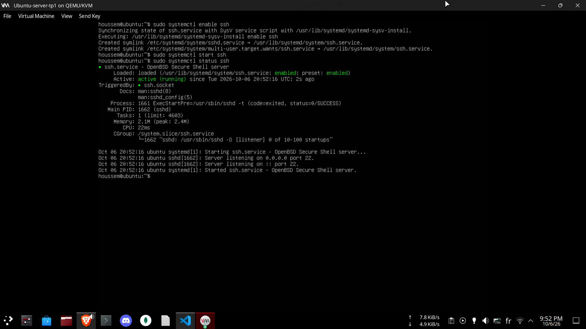

---

### 2. SSH Connection

The SSH connection was tested from the physical machine.

```bash
ssh houssem@192.168.122.125
```

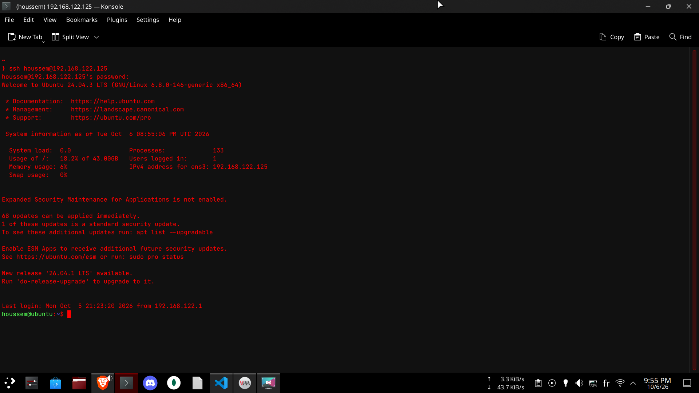

---

### 3. Docker Installation

Docker was installed on the Ubuntu Server.

```bash
# Add Docker's official GPG key:
sudo apt update
sudo apt install ca-certificates curl
sudo install -m 0755 -d /etc/apt/keyrings
sudo curl -fsSL https://download.docker.com/linux/ubuntu/gpg -o /etc/apt/keyrings/docker.asc
sudo chmod a+r /etc/apt/keyrings/docker.asc

# Add the repository to Apt sources:
sudo tee /etc/apt/sources.list.d/docker.sources <<EOF
Types: deb
URIs: https://download.docker.com/linux/ubuntu
Suites: $(. /etc/os-release && echo "${UBUNTU_CODENAME:-$VERSION_CODENAME}")
Components: stable
Architectures: $(dpkg --print-architecture)
Signed-By: /etc/apt/keyrings/docker.asc
EOF

sudo apt update

sudo apt install docker-ce docker-ce-cli containerd.io docker-buildx-plugin docker-compose-plugin

sudo systemctl enable docker
sudo systemctl start docker
docker --version
```

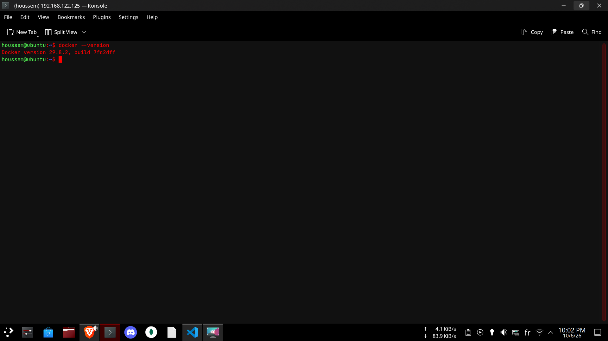

---

### 4. Jenkins Installation

Jenkins was installed as a service on Ubuntu Server.

#### Installation

```bash
sudo apt update
sudo apt install fontconfig openjdk-21-jre -y

sudo wget -O /etc/apt/keyrings/jenkins-keyring.asc \
  https://pkg.jenkins.io/debian-stable/jenkins.io-2026.key

echo "deb [signed-by=/etc/apt/keyrings/jenkins-keyring.asc]" \
  https://pkg.jenkins.io/debian-stable binary/ | sudo tee \
  /etc/apt/sources.list.d/jenkins.list > /dev/null

sudo apt update
sudo apt install jenkins -y
```

#### Start Jenkins

```bash
sudo systemctl enable jenkins
sudo systemctl start jenkins
sudo systemctl status jenkins
```

#### Initial Password

```bash
sudo cat /var/lib/jenkins/secrets/initialAdminPassword
```

Jenkins was accessed from the physical machine:

```text
http://IP_ADDRESS:8080
```

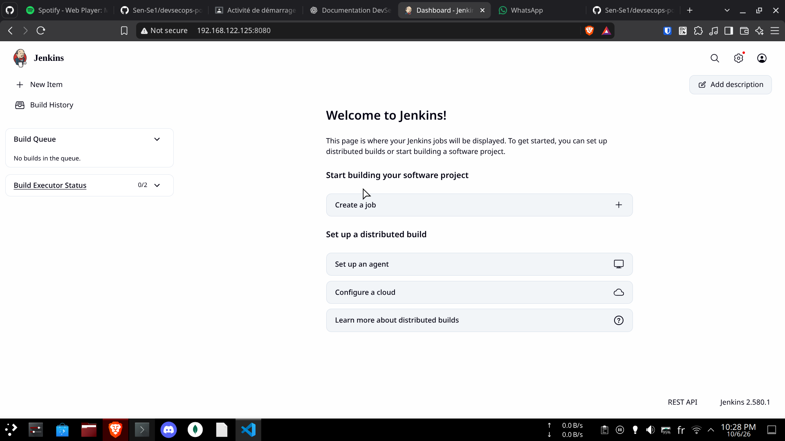

---

### 5. Mini CV

A one-page CV was created using HTML5, CSS3 and JavaScript.

The project was managed with Git and published on GitHub.

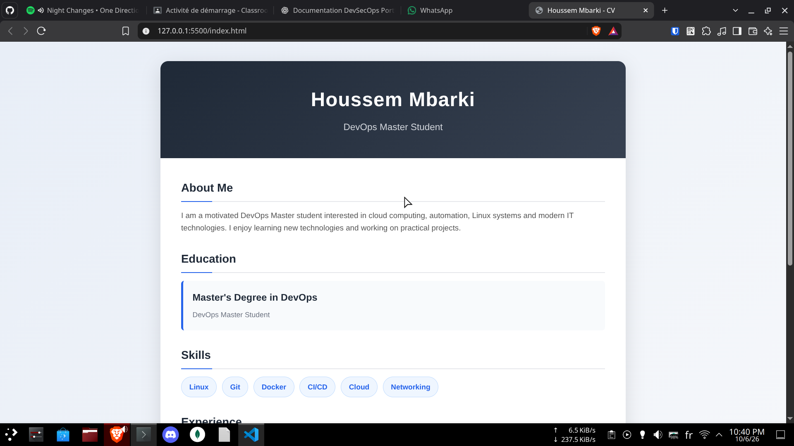

**GitHub:** `https://github.com/Sen-Se1/devsecops-portfolio`

---

### 6. GitHub SSH

An SSH key was created and added to GitHub.

```bash
ssh-keygen -t ed25519 -C "your@email.com"
eval "$(ssh-agent -s)"
ssh-add ~/.ssh/id_ed25519
cat ~/.ssh/id_ed25519.pub
```

SSH connection was tested:

```bash
ssh -T git@github.com
```

The repository was configured to use SSH:

```bash
git remote set-url origin git@github.com:Sen-Se1/devsecops-portfolio.git
git remote -v
```

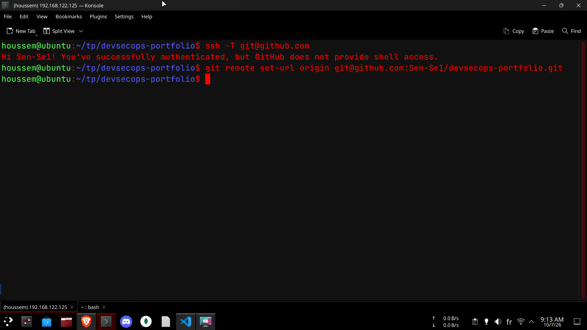

---

## II. Evolution of the mini-CV to DevSecOps Portfolio

### 7. DevSecOps Portfolio

The Mini CV was improved into a small DevSecOps Portfolio.

#### Improvements

- Added a navigation bar.
- Added About section.
- Added Skills section.
- Added Projects section.
- Added Experience section.
- Added Contact section.
- Improved the design and responsive layout.

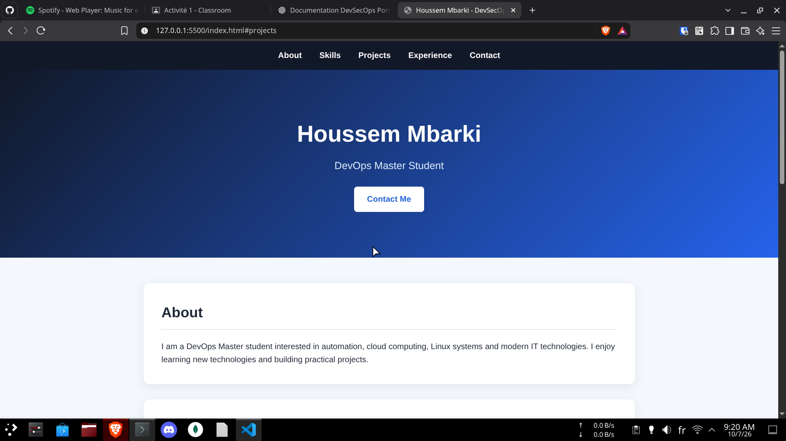

---

### 8. DevSecOps Skills

A DevSecOps Skills section was added with the main technologies used in the project.

Technologies:
- Git
- Docker
- Jenkins
- Kubernetes
- Ansible
- Terraform
- Argo CD

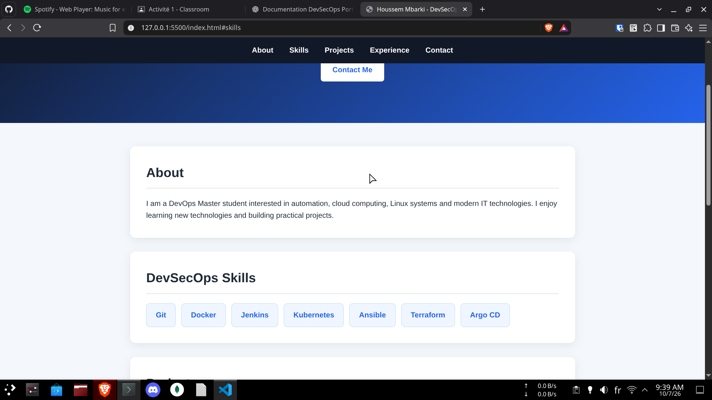

---

### 9. Dynamic Projects

The Projects section is generated dynamically using JavaScript from an array of objects.

#### JavaScript

```javascript
const projects = [
    {
        title: "Mini CV",
        description: "One-page CV developed using HTML5, CSS3 and JavaScript."
    },
    {
        title: "DevOps Lab",
        description: "Practical environment using Linux, Git, Docker and CI/CD."
    }
];
```

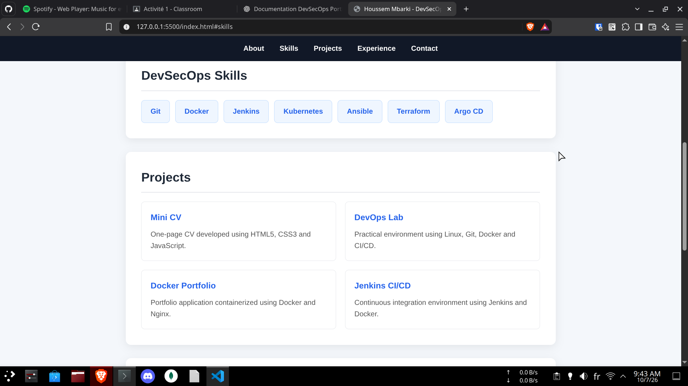

---

## III. Initial Dockerization

### 10. Dockerfile

A Dockerfile was created to serve the portfolio using Nginx.

```dockerfile
FROM nginx:alpine

COPY index.html /usr/share/nginx/html

EXPOSE 80

CMD ["nginx", "-g", "daemon off;"]
```

---

### 11. Docker Image

The Docker image was built with the name `cv-docker`.

```bash
docker build -t cv-docker .
docker images
```

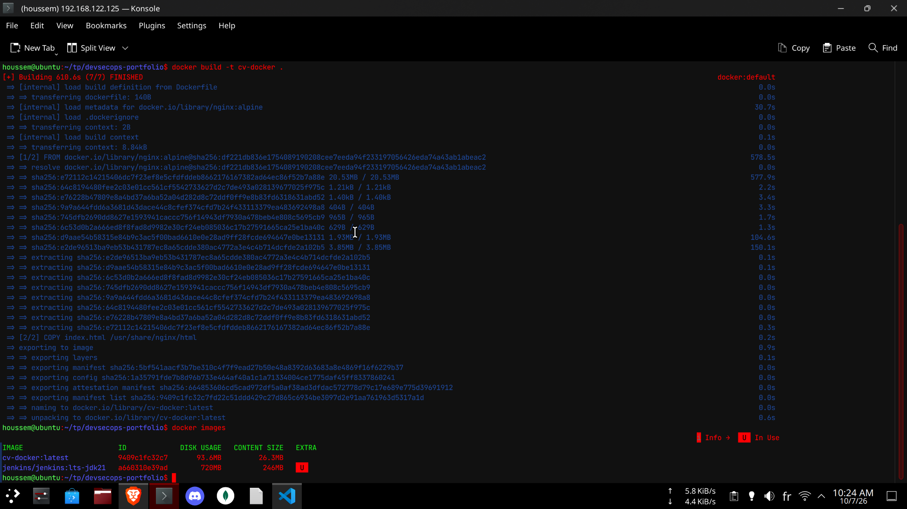

---

### 12. Docker Container

The portfolio was started in a Docker container.

```bash
docker run -d --name cv-container -p 8080:80 cv-docker
docker ps
```

The portfolio was accessed from the physical machine:

```text
http://192.168.122.125:8080
```

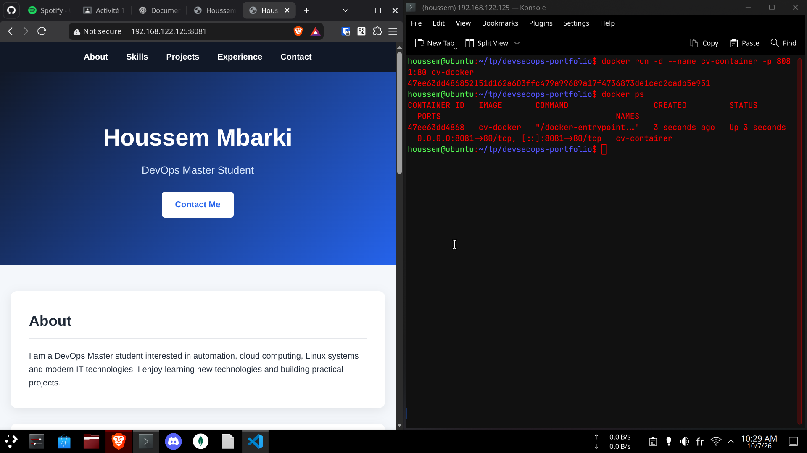

---

### 13. Docker Compose

The portfolio was deployed using Docker Compose.

```bash
docker compose up -d
docker compose ps
```

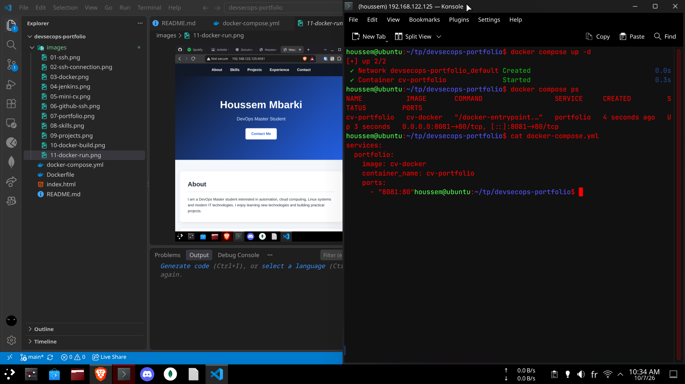

---

### 14. GitHub Update

The modifications were published on GitHub using SSH.

```bash
git add .
git commit -m "Add DevSecOps portfolio and Docker"
git push
```

**GitHub:** `https://github.com/Sen-Se1/devsecops-portfolio`

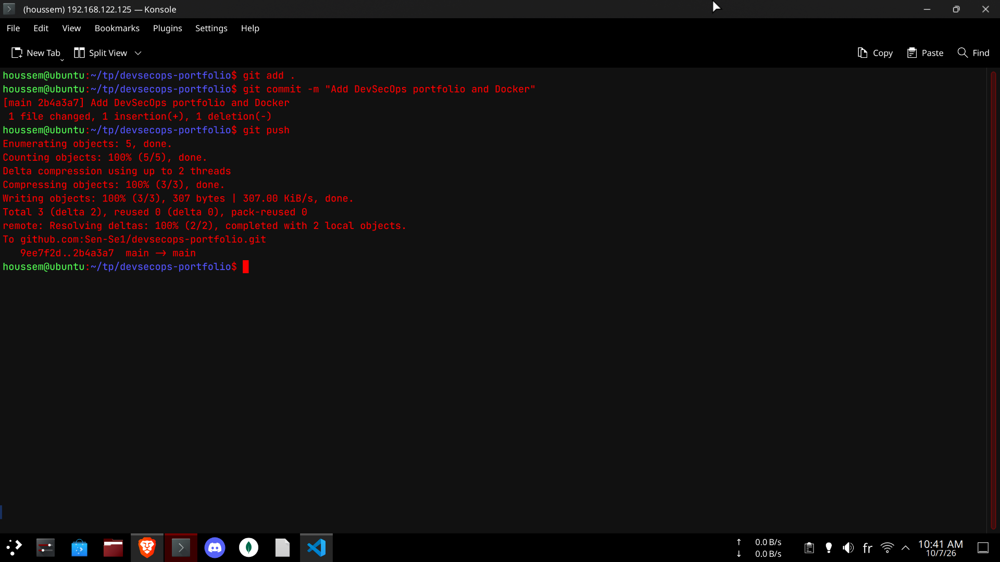

---

## IV. First introduction to automation

### 15. Vagrant

Vagrant was installed inside the Ubuntu Server VM using the official HashiCorp documentation.

#### Install Vagrant

```bash
wget -O - https://apt.releases.hashicorp.com/gpg | sudo gpg --dearmor -o /usr/share/keyrings/hashicorp-archive-keyring.gpg

echo "deb [arch=$(dpkg --print-architecture) signed-by=/usr/share/keyrings/hashicorp-archive-keyring.gpg] https://apt.releases.hashicorp.com $(grep -oP '(?<=UBUNTU_CODENAME=).*' /etc/os-release || lsb_release -cs) main" | sudo tee /etc/apt/sources.list.d/hashicorp.list

sudo apt update
sudo apt install vagrant -y
```

Check the installation:

```bash
vagrant --version
```

#### Configure KVM / Libvirt

The VM supports nested virtualization.

```bash
systemd-detect-virt
lscpu | grep -i virtualization
```

KVM and Libvirt were installed:

```bash
sudo apt update
sudo apt install qemu-kvm libvirt-daemon-system libvirt-clients virtinst -y
```

The required development dependencies were installed for the Vagrant Libvirt provider:

```bash
sudo apt install build-essential -y
sudo apt install libvirt-dev libxml2-dev libxslt1-dev ruby-dev pkg-config -y
```

The current user was added to the required groups:

```bash
sudo usermod -aG libvirt $USER
sudo usermod -aG kvm $USER
newgrp libvirt
```

#### Install Vagrant Libvirt Provider

```bash
vagrant plugin install vagrant-libvirt
```

Check the provider:

```bash
vagrant plugin list
```

#### Vagrantfile

```ruby
Vagrant.configure("2") do |config|

  config.vm.box = "generic/ubuntu2204"

  config.vm.define "devsecops-vm"
  config.vm.hostname = "devsecops-vm"

  config.vm.provider :libvirt do |libvirt|
    libvirt.memory = 1024
    libvirt.cpus = 1
  end

end
```

The VM was created using:

```bash
vagrant up --provider=libvirt
```

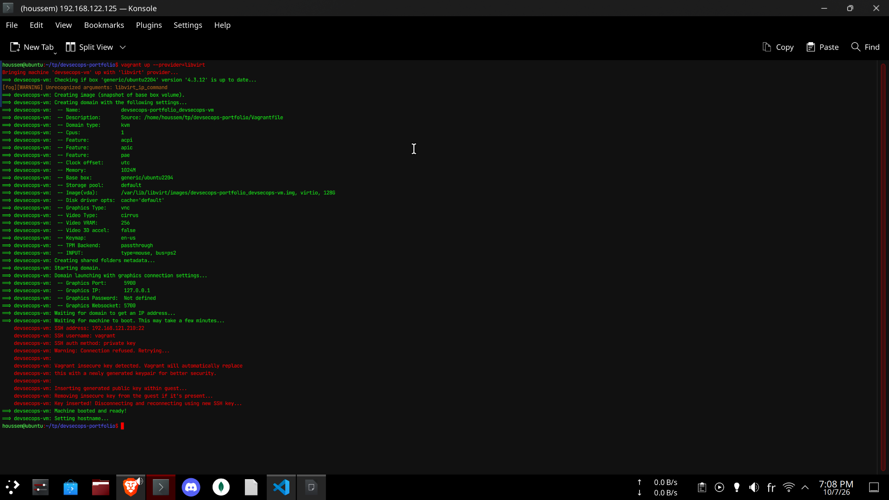

---

### 16. Vagrant SSH

The VM created by Vagrant was accessed using:

```bash
vagrant ssh
```

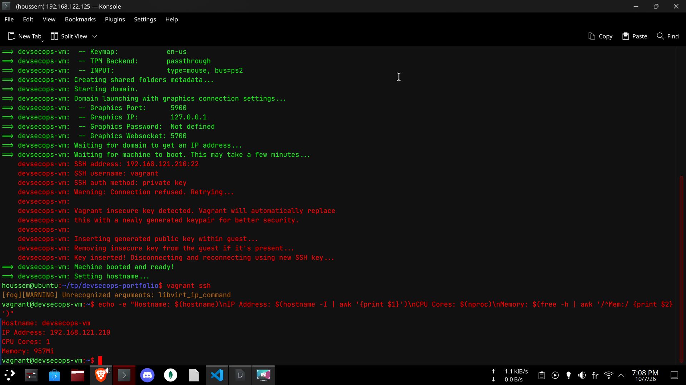

#### Comparison

Vagrant allows the VM to be created automatically from a `Vagrantfile`, while manual VM creation requires configuring the VM step by step.

---

### 17. Vagrant Configuration

The `Vagrantfile` was modified to automatically configure the VM name, hostname, private IP address, memory and CPU.

#### Vagrantfile

```ruby
Vagrant.configure("2") do |config|

  config.vm.box = "generic/ubuntu2204"

  config.vm.define "devsecops-vm-update"

  config.vm.hostname = "devsecops-vm-update"

  config.vm.network "private_network", ip: "192.168.56.10"

  config.vm.provider :libvirt do |libvirt|
    libvirt.memory = 2048
    libvirt.cpus = 2
  end

end
```

#### Apply the Configuration

```bash
vagrant destroy -f
```

```bash
vagrant up --provider=libvirt
```

#### Check VM Status

```bash
vagrant status
```

Example result:

```text
Current machine states:

devsecops-vm-update       running (libvirt)
```

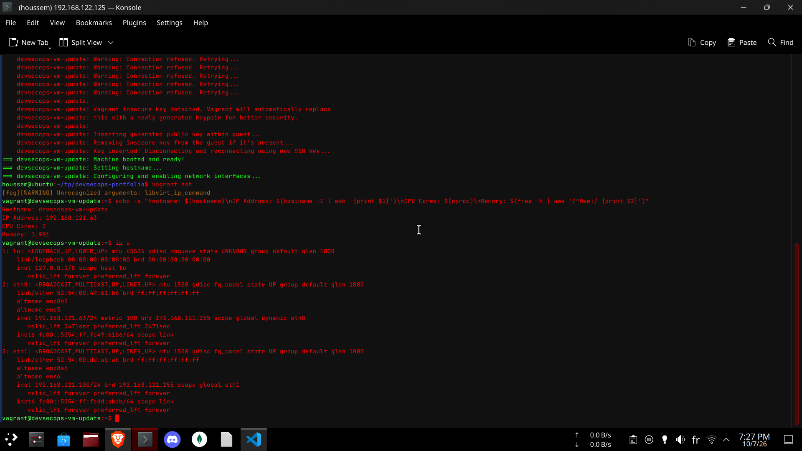

The VM is automatically configured with the name and hostname `devsecops-vm-update`, the private IP address `192.168.56.10`, 2 GB of RAM and 2 CPUs.

#### Why not use `vagrant reload --provider=libvirt`?

`vagrant reload` only halts and restarts an **existing** VM. It does not fit this change, for these reasons:

- **The VM name changed.** `config.vm.define` sets the machine name, so Vagrant treats `devsecops-vm-update` as a new machine. No libvirt domain exists for it yet, and `reload` fails with "Domain is not created. Please run `vagrant up` first". The VM has to be created with `vagrant up`.
- **Network changes may not apply cleanly.** After adding the private network, Vagrant warned that the number of network adapters in the config (2) differed from the attached interfaces (1) and "may have incorrectly updated". A reload can keep the old interface layout, whereas recreating the VM guarantees `eth1` with the private IP.
- **The `--provider` flag is useless on reload.** The provider is fixed when the machine is created, so `--provider=libvirt` is ignored. It only matters on the first `vagrant up`.
- **Reproducibility.** `vagrant destroy -f` followed by `vagrant up` rebuilds the VM entirely from the Vagrantfile, which proves the configuration is fully automatic and leaves no leftovers from the old setup.

`vagrant reload` is still fine for small changes to an existing VM, such as memory or CPU only.

---

## V. Portfolio migration to Next.js

### 18. Creating the DevSecOps Portfolio with Next.js

A new version of the **DevSecOps Portfolio** was created using **Next.js**.

The new version keeps the main sections from the HTML5/CSS3/JavaScript version:

- **About**
- **DevSecOps Skills**
- **Projects**
- **Experience**
- **Contact**
- **Footer**

The skills and projects are displayed dynamically from JavaScript arrays using the `.map()` method.

#### Creating the Next.js Project

The project was created using the following command:

```bash
npx create-next-app@latest devsecops-portfolio-next --yes
```

Then:

```bash
cd devsecops-portfolio-next
npm run dev
```

The application is accessible from the physical machine through port `3000`:

```text
http://192.168.122.125:3000
```

#### Current Structure

```text
devsecops-portfolio-next/
├── app/
│   ├── page.js
│   ├── globals.css
│   └── layout.js
├── public/
├── package.json
└── ...
```

The `page.js` file currently contains the Next.js Portfolio, while `globals.css` contains its styling.

#### Application Screenshot

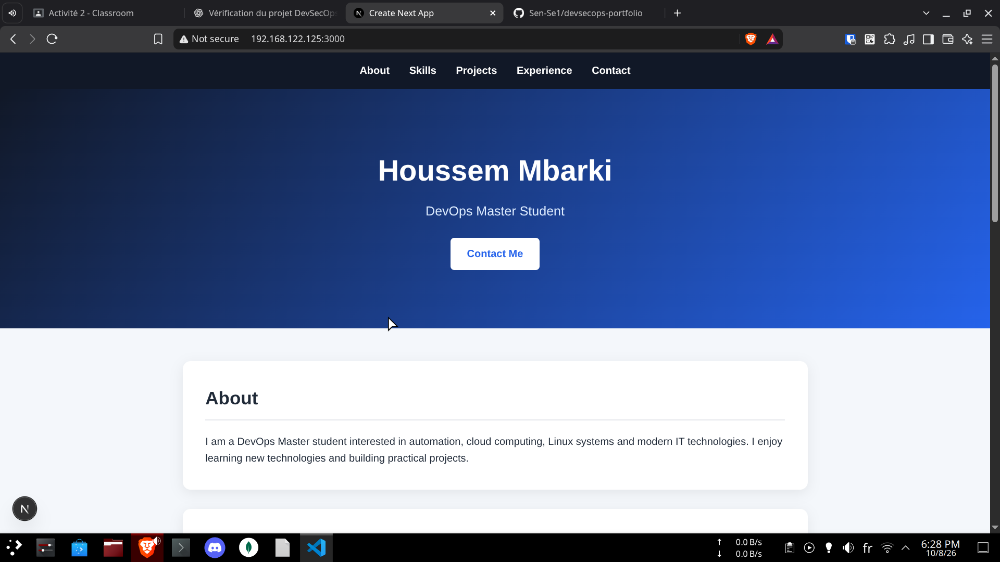

---

### 19. Creating Reusable Components

The main parts of the Portfolio were transformed into reusable TypeScript components.

#### Component Structure

```text
devsecops-portfolio-next/
├── app/
│   ├── page.tsx
│   ├── globals.css
│   └── layout.tsx
├── components/
│   ├── Header.tsx
│   ├── About.tsx
│   ├── Skills.tsx
│   ├── Projects.tsx
│   ├── Contact.tsx
│   └── Footer.tsx
├── public/
└── package.json
```

The components are used in `app/page.tsx` to build the Portfolio page.

---

### 20. Separating Project and Skill Data

The project and skill information was moved into separate data files to keep the components clean and easier to maintain.

#### Data Structure

```text
devsecops-portfolio-next/
├── app/
│   ├── page.tsx
│   ├── globals.css
│   └── layout.tsx
├── components/
│   ├── Header.tsx
│   ├── About.tsx
│   ├── Skills.tsx
│   ├── Projects.tsx
│   ├── Contact.tsx
│   └── Footer.tsx
├── data/
│   ├── skills.ts
│   └── projects.ts
├── public/
└── package.json
```

#### Example of Skills Data

```ts
export const skills: string[] = [
  "Git",
  "Docker",
  "Jenkins",
  "Kubernetes",
  "Ansible",
  "Terraform",
  "Argo CD",
];
```

#### Example of Projects Data

```ts
export type Project = {
  title: string;
  description: string;
};

export const projects: Project[] = [
  {
    title: "Mini CV",
    description:
      "One-page CV developed using HTML5, CSS3 and JavaScript.",
  },
  {
    title: "DevOps Lab",
    description:
      "Practical environment using Linux, Git, Docker and CI/CD.",
  },
  {
    title: "Docker Portfolio",
    description:
      "Portfolio application containerized using Docker and Nginx.",
  },
  {
    title: "Jenkins CI/CD",
    description:
      "Continuous integration environment using Jenkins and Docker.",
  },
];
```

The `Skills.tsx` and `Projects.tsx` components import this data and use it to dynamically display the skills and projects.

---

### 21. Creating Dedicated Project Pages

A dedicated project section was added to the Next.js Portfolio.

The `/projects` page displays all available projects, while the dynamic route `/projects/project-name` displays the details of a specific project.

#### Routes

```text
/projects
/projects/mini-cv
/projects/devops-lab
/projects/docker-portfolio
/projects/jenkins-cicd
```

#### Project Page Structure

```text
app/
└── projects/
    ├── page.tsx
    └── [project-name]/
        └── page.tsx
```

The projects are loaded from the separate `data/projects.ts` file, and each project has a unique `slug` used to generate its URL.

#### Screenshot

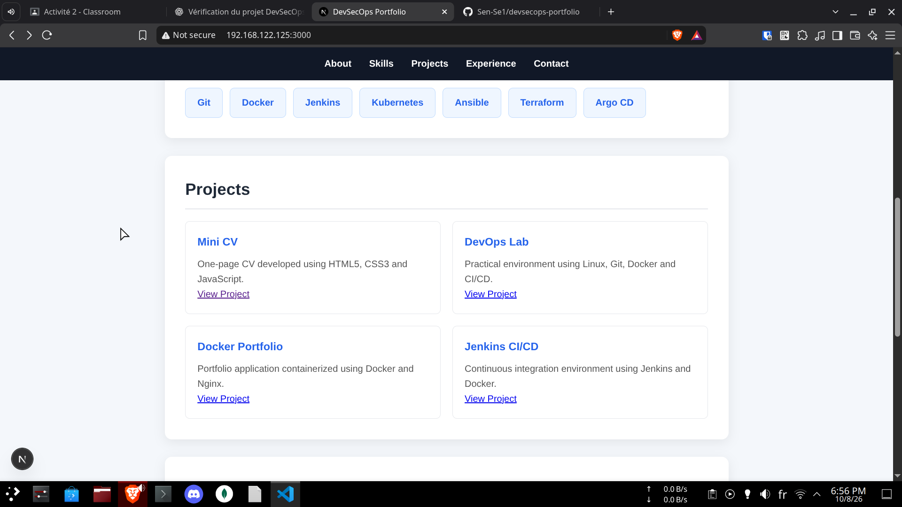

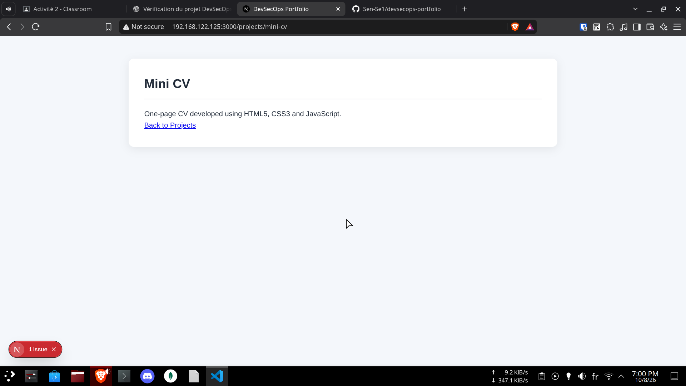

---

---